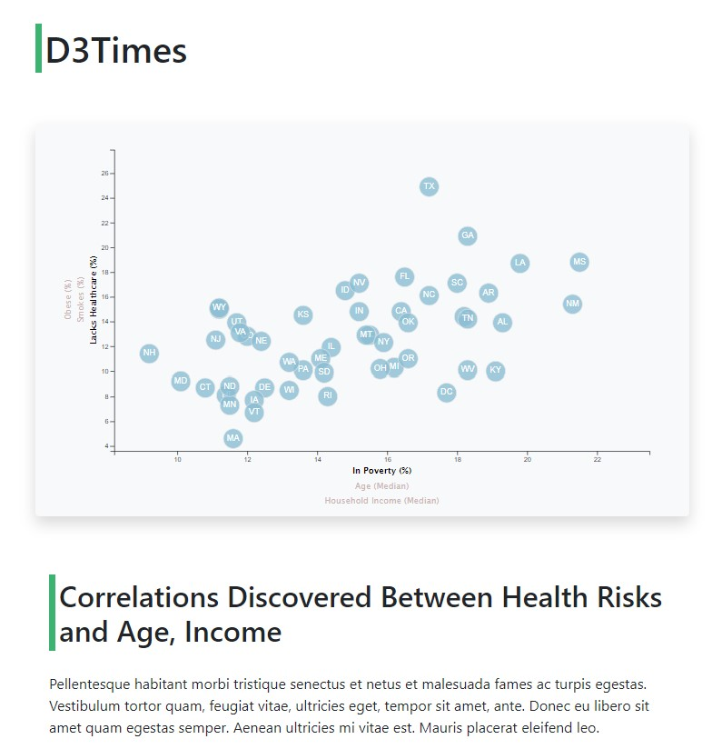
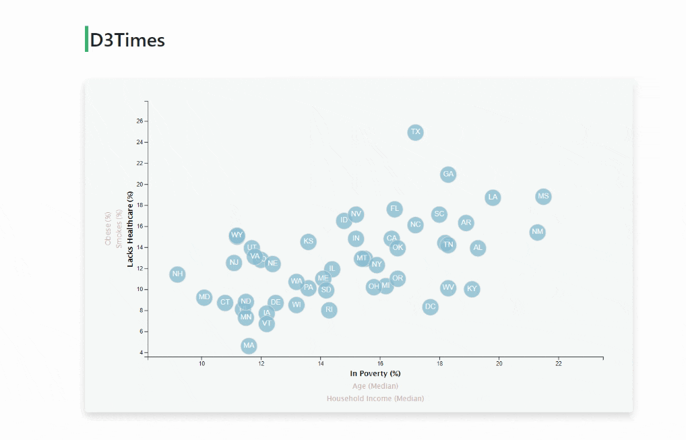

# D3-Challenge
__Interactive Dashboard built with D3.js - a JavaScript Library  for visualizing data using web standards.__


 [divya-gh.github.io/Plotly.ly](https://divya-gh.github.io/Plotly.ly-Challenge/)


## Table of contents
* [Project Title ](#project-title)
* [Description](#description)
* [Objective](#objective)
* [Screen Shots](#screen-shots)
* [Technologies](#technologies)
* [Code](#code)
* [Status](#status)
* [Acknowledgement ](#acknowledgement )
* [Contact](#contact)


## Project Title : Data Journalism and D3

### Description 
This project aims at building a interactive dashboard for a major metro paper to analyze the current trends shaping people's lives.
Charts and graphs feature stories about the health risks facing particular demographics.

### Data Set
- The dataset is from U.S. Census Bureau and the Behavioral Risk Factor Surveillance System.
-  Dataset is based on 2014 ACS 1-year estimates from the US Census Bureau which includes data on rates of income, obesity, poverty, etc. by state. MOE stands for "margin of error."

## Objective
### Step 1 - D3 Dabbler

- Use python -m http.server to run the visualization and to host the page at localhost:8000 in your web browser.
- Make a webcall using d3.csv promise function.
- Create a scatter plot between two of the data variables such as Healthcare vs. Poverty or Smokers vs. Age.
	* Scatter plot that represents each state with circle elements.
	* Include state abbreviations in the circles.
	* Create and situate your axes and labels to the left and bottom of the chart.

### Step 2 - Create an interactive animated scatter chart

- Place additional labels in your scatter plot and give them click events so that your users can decide which data to display.
- Animate the transitions for your circles' locations as well as the range of your axes.
- Include 3 risk factors for each axis.
- binding all of the CSV data to your circles.
- include state Abbr as text inside the circle.



### Step 3 - Render ToolTip 
- Add tooltips to your circles and display each tooltip with the data that the user has selected. 
- Use the d3-tip.js plugin developed by [Justin Palmer](https://github.com/caged/d3-tip).


## Screen Shots

### Step 1 - Scatter Plot Healthcare vs. Poverty


### Step 2 - Interactive D3 chart with all the Risk factors:



## Technologies and Tools
* Visual Studio Code Editor
* GitBash, GitHub , Git Pages
* chrome DOM
* HTML , CSS, Bootstrap
* JavaScript
#### Java Script Libraries and pluggins :
* D3.js	
* D3-tip.js
	

## Code 
- [D3 Code](/assets/js/app.js)

## Setup
- Git clone with HTTPS link
- Git bash and run python server to render the page on port 8000
- play with the d3 chart
- Open [D3 Code](/assets/js/app.js) in visual studio

## Status
Project Complete

## Acknowledgement 
- UTSA BootCamp
- Jeff Anderson(Boot Camp Instructor for being the best)
- [stackoverflow.com for helping with assigning text to circles](https://stackoverflow.com/questions/44339929/put-text-in-the-middle-of-a-circle-using-d3-js)



## Contact
 [Divya Shetty](https://github.com/divya-gh)
 

